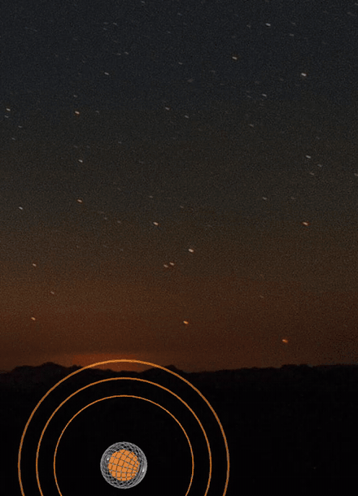
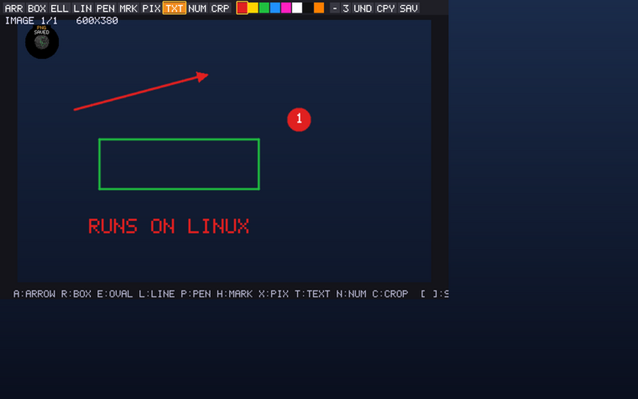
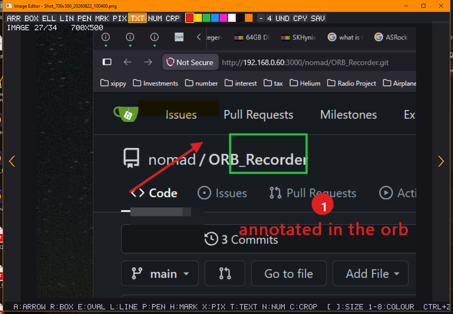

# ORB_Recorder

A dime-sized always-on-top orb that records your screen to **GIF** or **MP4
with sound**, records a **camera**, takes **screenshots**, and views **every
image format your machine has a decoder for**.



*The orb recording itself.* It is mid-MP4 — magenta, `REC` — while its own
right-click menu is open on top of it. A popup menu is a modal loop that parks
the program that opened it; the capture runs straight through it anyway.
[Full quality](media/orb_records_its_own_menu.mp4).

One keypress. No dialogs. No account. No installer. **One 900 KB binary** —
copy it anywhere, run it, and tick *Run at startup* if you want it back at
login. Delete the file and it's uninstalled.

**Public domain.** Take it, sell it, fork it, ship it. See `LICENSE`.

By **Alex Maximilius** — *Alex Maz* — [github.com/AlexMaximilius](https://github.com/AlexMaximilius)
Dedicated to the public domain by its copyright holder, 2026.

---

## Run it

Double-click `orb_recorder.exe`. An orange orb appears. Drag it somewhere
you'll remember — it stays there across restarts, and comes back to the same
corner of the same monitor even if that monitor was asleep at boot.

| key | does |
|---|---|
| **F4** / **PrintScreen** | drag a rectangle → **PNG**, on the clipboard, opens in the editor |
| **F5** | record the focused window → GIF |
| **F6** | drag a region → GIF |
| **F7** | record the focused window → MP4 with sound |
| **F8** | drag a region → MP4 with sound |
| **F9** | record a camera → MP4 |
| **Esc** | stop |
| **F1** | help, every binding |

Press again to stop. Files land in `Pictures\ORB_Recorder\`, named after the
window you recorded, **already on your clipboard** — alt-tab to a chat window
and paste.

Also: **double-click** the orb to arm, then click the window you want.
**Scroll** over it to resize. **Right-click** for everything else — monitor
capture, a **delayed screenshot** that can photograph an open menu, sound
source, *Run at startup*, and a checkbox per hotkey so you can hand F5 back to
whatever else wants it.

**Drop a file on the orb.** GIFs open a frame editor with trim. Images open
the annotation editor. Videos open in your default player.

Colour is state: orange idle, yellow armed, **red recording GIF**, **magenta
recording video**, **cyan recording camera**, green editing.

---

## New in 3.6 — a first run lands in the right corner

On a machine with no settings file the orb appeared at the top-left, hardcoded
to (50,50) — where titlebars, menus and half the world's window buttons live,
so the very first thing a new user saw was the orb sitting on top of
something. The recovery path twenty lines further down had always chosen
bottom-right; first run now uses the same calculation.

It survived this long because every machine here has a settings file older
than the question. It took a laptop that had never run the program before to
show the default anybody else would get.

---

## New in 3.5 — Wayland tells the truth

3.4 was tested under Xvfb, which has no window manager and is real X11. A
laptop running **GNOME on Wayland** is neither, and it found two things that
setup could not.

**On Wayland, capture was silently returning black.** X clients there talk to
XWayland, whose root window is not the desktop. Everything else worked
perfectly — the orb drew, the hotkey fired, the region selector appeared, a
PNG was written, the editor opened on it — and the image was 700×400 of pure
black, mean 0, standard deviation 0, reported as *Saved*. `import` and `xwd`
fail outright on the same display; we succeeded and returned nothing.

It now says so, at startup and again on every capture. The check asks the **X
server** whether the XWAYLAND extension is present rather than reading
`XDG_SESSION_TYPE` — the first version read the environment and reported a
healthy X11 session in exactly the case it was written to catch, because a
process started over ssh inherits none of the session variables. Real Xorg is
unaffected and says nothing.

Capturing a Wayland desktop properly means xdg-desktop-portal ScreenCast over
PipeWire. That is a real dependency and a real project; until then the honest
thing is to refuse to pretend.

**The orb was landing in the wrong place on every managed desktop.** It is
drawn in the middle of a window several times its size, so putting it near a
corner needs the window at negative coordinates — and a window manager refuses.
Mutter clamped (-276,-276) to (66,32), leaving the orb about 340 px adrift.
The orb window is now `override-redirect`: furniture rather than an
application window, which is what a desktop widget is and what docks have done
for decades. The editor and the region selector stay ordinary managed windows,
because they want a titlebar and focus.

---

## New in 3.4 — it runs on Linux



Not "compiles on Linux" — *runs*. Ubuntu 24.04, X11, software GL: the orb
draws, F4 grabs a region, the capture is written as a PNG, and the editor
opens on it. Everything above is that machine.

Three bugs were waiting there, and one of them was on Windows all along.

**Nothing could be typed on X11.** Hotkey polling used
`XCheckMaskEvent(KeyPressMask)`, which pulls *every* key press off the
connection — including the ones on their way to our own windows, because GLFW
shares that connection — and discarded anything that was not a registered
hotkey. The mouse worked perfectly, so the editor looked fine until you tried
to press a key. It now takes only events delivered to the grab window, and
leaves the rest where they were. That is the Windows bug from 2.1 exactly
inverted: there a foreign message pump ate our hotkeys, here we were the
thief.

**The boot settle loop was comparing against the wrong formula** — the orb's
offset inside its window is `(window - orb) / 2`, not `orb`. The window was
always precisely where it belonged and this declared it drifted, every frame,
for the whole settle period. Harmless except that it buried the boot log: a
Windows start wrote hundreds of "window drifted" lines, and now writes none.
It took a display with no window manager for the numbers to be odd enough to
look at.

**Three silent truncations**, flagged by GCC 13 where MinGW had never
mentioned them. One mattered: the path handed to the editor was held in a
buffer smaller than the path itself, so a long enough filename would have
opened the editor on the wrong file.

`glfwInit` failing also used to report "no display?" whatever the cause. It
now asks GLFW and prints what actually happened — a missing GLX extension, a
driver that cannot make a context and an unreachable X server are three
different problems, and they all looked identical.

Both platforms now build with **zero warnings**.

---

## New in 3.3 — the editor stops losing things

**The browse chevrons only appear when you are browsing.** They sit down each
side of the editor, and on a capture you have just taken they are both noise
and a hazard: they cover exactly where an annotation wants to be drawn, so an
arrow near the edge paged the folder instead. A capture is a document; a file
you dropped or picked is an entry in a folder. Now the chevrons follow that
distinction, and reappear the moment you page with PgUp/PgDn.

**Undo records the rectangle a step disturbed, not the whole picture.** The
first version snapshotted the entire image per step, on the reasoning that
screenshots are small. A region grab is; a 4K screen is 33 MB, and twelve of
those on the undo stack plus twelve on the redo stack is 800 MB for having
drawn twelve arrows. An arrow disturbs about 400 KB. Crop is the one operation
that changes the dimensions and still keeps a whole-image entry, which is both
rare and the only case that needs one.

**Unsaved marks are saved rather than dropped.** Take a screenshot while the
editor is open with an unsaved arrow on it, or page to the next file, and the
old image used to be thrown away along with the work. Prompting is not an
option in a program where nothing is a dialog, and the answer is not in doubt
anyway — `Ctrl+S` already overwrites, and the version anyone wants is the
annotated one. So it just saves.

Undo being exact is checked rather than eyeballed: the test draws eight steps
— arrow, box, oval, marker, pixelate, freehand, numbered disc and text —
undoes all eight, saves, and compares the SHA-256 against the untouched
capture. A bounding box one pixel too small leaves residue, and residue would
change the hash.

---

## New in 3.2 — screenshots got ten times smaller

The PNG writer used to emit *uncompressed* deflate blocks. That is valid PNG
and every viewer opens it, and it cost exactly four bytes per pixel: a 640×460
capture came out at **1.18 MB**. These files exist to be pasted into chat
windows, so that was the wrong trade to keep.

The same capture is now **126 KB — 9.3× smaller**, and a 4K screen goes from
33 MB to 180 KB. Three stages, in order of how much each one buys:

- **Drop the alpha channel when every pixel is opaque.** Screen captures
  always are. A quarter gone before anything is compressed.
- **Filter each row adaptively** — None/Sub/Up/Average/Paeth, picked per row
  by minimum sum of absolute differences. This is most of the win: a run of
  identical pixels filters to zeroes.
- **LZ77 with a 32K window and lazy matching**, as fixed-Huffman blocks.
  Fixed, not dynamic — dynamic would gain perhaps another 15% and costs tree
  construction and a tree encoder, both of which can be subtly wrong.

If compression would not beat the raw bytes — pure noise does not compress —
the old stored-block path is still there and is used instead, so the writer
can never produce a file bigger than it used to.

It costs some time, and here is the honest measurement rather than a claim,
same machine, same content, including the write to disk:

| capture | before | after | bytes before | bytes after |
|---|---|---|---|---|
| 1920×1080 | 49 ms | 81 ms | 8.3 MB | 47 KB |
| 2560×1440 | 83 ms | 133 ms | 14.7 MB | 82 KB |
| 3440×1440 | 121 ms | 179 ms | 19.8 MB | 108 KB |
| 3840×2160 | 195 ms | 318 ms | 33.2 MB | 180 KB |

Region grabs — most screenshots — are a few milliseconds either way. And the
file being written is now a hundredth the size, which the table's disk time
partly gives back on anything slower than a local SSD.

Every output is round-tripped in the test suite and compared pixel for pixel,
through **three independent decoders**: the vendored `stb_image`, Python's
`zlib` with the unfiltering written out by hand, and PIL. That is deliberate
paranoia — the GIF LZW encoder once produced files that decoded cleanly for
two frames and then fell apart, and one decoder agreeing with the encoder that
wrote it proves very little.

---

## New in 3.1 — the editor is ours now



3.0 handed screenshots to Paint. This one has its own editor, because Paint is
being retired and because a screenshot editor is about four hundred lines when
you already own a window, a texture and a PNG writer.

Take a shot and it opens here: **arrow, box, oval, line, freehand, marker,
pixelate, text, numbered steps, crop**. Eight colours, a thickness, undo and
redo, `Ctrl+C` for the clipboard and `Ctrl+S` to save over the file. Every
tool is one key — the row along the bottom of the window lists them so there
is nothing to memorise. It works on any image you drop on the orb, not only on
screenshots.

Three things about it are deliberate:

**A stroke is rasterised the moment you let go.** Greenshot keeps each
annotation as a live object you can move afterwards, which is genuinely nicer
and costs a selection model, hit-testing, drag handles, z-order and a document
format. Undo covers the same ground for a fraction of the code, and one pixel
buffer is the whole document.

**The preview is the result.** The shape you see while dragging is drawn by
the same `paint.h` call that commits it, into the same buffer. An editor that
previews on the GPU and saves on the CPU has two rasterisers and eventually
two answers; this one cannot disagree with itself. It repaints only the dirty
rectangle, so a drag stays smooth on a 4K screenshot instead of pushing 30 MB
per mouse-move.

**The marker multiplies and the obfuscator averages.** A highlighter that
covers the text it marks is a redaction, so `MRK` keeps the darker of the two
channels and the words stay readable through the colour. Obfuscation is a
block average rather than a blur, because blurs have been reversed on
published screenshots more than once and an average has nothing left to
reverse.

Text uses the **system font** via a coverage mask from GDI, so labels are real
mixed-case type rather than the built-in 5×7 glyphs. Where no font engine is
available — X11, today — it falls back to those glyphs rather than dropping
the text.

Paint is still one click away: *After a screenshot, open >* in the right-click
menu picks between the built-in editor, the system image editor, and nothing
at all.

---

## New in 3.0

**Every screenshot opens in Paint, and in its folder.** A screenshot is
almost never finished at the moment it is taken — something in it wants
circling, cropping, or blanking out — so the shot now arrives in an image
editor with the folder behind it, on top of already being on the clipboard.
Region, window and delayed captures all behave the same way. (3.1 replaced
Paint with the built-in editor and turned the checkbox into the three-way
*After a screenshot, open >* above.)

Not hardcoded to Paint: it asks the shell for the **`edit` verb**, which is a
different thing from `open`. Double-clicking a `.png` gets you a viewer;
`edit` gets you whatever the machine uses for editing images — Paint out of
the box, Paint.NET or GIMP or Photoshop if you've said so, and no change here
when you change your mind. Where no edit verb is registered at all, Paint is
asked for by name rather than nothing happening. On Linux there is no such
verb, so it looks for a real editor first and only falls back to `xdg-open`.

---

## New in 2.1

**Recording no longer stops while the orb's own right-click menu is open.**
A popup menu is a modal message loop: it does not return until the menu
closes, and it is entered from inside an input callback, so the entire main
loop — capture included — was parked for as long as the menu was up. Frames
were not being dropped, they were never being taken. The capture tick is now
driven by a timer message, which the modal loop dispatches like any other. On
a nine-second clip with the menu held open for five of them: **76 frames
before, 231 after.** The GIF at the top of this page is the result.

**Hotkeys no longer disappear while that menu is open.** They were registered
against the thread, which makes `WM_HOTKEY` a thread message with no window to
be delivered to — so any message pump that was not ours pulled it out and
dropped it. Registering against the window instead means every pump routes it
home.

**A delayed screenshot** in the right-click menu, because a still of an open
menu has no other route: every screenshot hotkey is an interactive region
drag, and interacting dismisses the menu you were trying to photograph.

Also: the version resource said 1.0.0.0 and now says what it is.

---

## What's interesting about it

**Screenshots are the fastest thing here.** Drag a rectangle and, before you
have finished letting go of the mouse: the PNG is written, the **image** is on
the clipboard (paste into a chat box), the **file** is on the clipboard (paste
as an attachment), and the folder is raised with the file selected. The
capture was never the slow part — finding the file afterwards was.

**GIF is capped at 7 MB and stops itself.** Not a preference, a design
decision: a GIF nobody can send is a failed GIF. Discord's free limit is 8 MB,
GitHub's is 10.

**It captures GPU-composited windows.** Browsers, Electron apps and games
render through DirectComposition, where the usual `BitBlt` returns a frozen
cached surface — which is why so many recorders produce a still image of a
moving window. This uses `PrintWindow(PW_RENDERFULLCONTENT)`, with a
screen-rectangle fallback.

**It captures elevated windows.** Windows UIPI blocks a normal process from
reading an admin window, so it detects the integrity mismatch and reads the
screen rectangle instead, which isn't blocked.

**Image formats come from the OS, not a hardcoded list.** It asks Windows
Imaging Component what decoders are installed — 14 codecs, 64 extensions on a
stock Windows 11 box, including HEIC/AVIF and the whole camera-RAW family. On
Linux it asks gdk-pixbuf. Install a codec and the viewer supports it with no
change here.

**It survives losing the display driver.** If no OpenGL context can be
created, the orb keeps running painted in 2D and **recording still works** —
capture is GDI and Media Foundation, which never needed OpenGL. The editor,
viewer and region select say so plainly instead of failing.

**No dependencies you have to go and get.** GIF encode and decode are written
here. Video is Media Foundation, audio is WASAPI loopback, thumbnails are the
shell, formats are WIC — all operating system components. No ffmpeg, no codec
pack, no runtime.

That claim is checked, not asserted. Every DLL the binary imports ships with
Windows:

```
advapi32  comdlg32  gdi32  glu32  kernel32  mf  mfplat
mfreadwrite  msvcrt  ole32  opengl32  shell32  user32
```

The GCC runtime is linked in statically (`-static`, 42 KB). Without that the
executable needs `libwinpthread-1.dll`, which exists only on machines that
have MinGW installed — so it runs on the machine that built it and fails on
every other one.

---

## Build it

**Windows** — needs MinGW-w64 (`gcc`, `windres`) and GLFW 3.3.8 binaries:

```
build.bat
```

Edit `GLFW_ROOT` inside if GLFW isn't at `C:\glfw-3.3.8.bin.WIN64`.

**Linux / X11**:

```
sudo apt install build-essential libglfw3-dev libx11-dev libxext-dev \
                 libxrandr-dev libgl1-mesa-dev libglu1-mesa-dev zenity xclip
./build.sh
```

### Test it

```
test.bat          (or ./test.sh)
```

Needs only the compiler; Python and Pillow are optional and add two more
decoders. Non-zero exit on failure, so it can gate a release.

It covers the two parts that are pure computation and can therefore be checked
by a machine rather than by looking: the annotation rasteriser and the PNG
writer. The rest of the program is a window, a hotkey and a screen grab, and
is tested by running it — but those two are exactly where a regression hides,
because **a broken compressor still produces files that open perfectly**. That
is not hypothetical: during development a stale copy of `png_write.h` shadowed
the real one, every output was silently uncompressed, and nothing looked wrong
at all. So the suite asserts compression *ratios*, not just correctness.

The rasteriser is checked against invariants rather than against a reference
image: every test buffer carries a guard band, shapes must clip, a filled
rectangle must cover exactly its own pixels, a rectangle dragged backwards
must equal the same rectangle dragged forwards, the marker must leave what it
marks readable, obfuscation must actually flatten a block, and a mask
overhanging the right edge must not wrap onto the next row.

Both failure modes were confirmed by breaking the code on purpose and watching
the suite name the cause — a test that has never failed is decoration.

> **Platform status, stated plainly.** Windows is the developed and daily-used
> target. As of 3.4 the Linux build has actually been **run against an X
> display** rather than merely compiled, on Ubuntu 24.04 under Xvfb with
> software GL.
>
> *Verified there:* the orb renders (shaped window, GL, transparency), global
> hotkeys via XGrabKey, the region selector, X11 screen capture, PNG output,
> and the whole annotation editor — mouse drawing, tool and colour keys, typed
> text, `Ctrl+S`. Format enumeration through gdk-pixbuf reports 27 decoders.
> The test suite passes with byte-identical output to Windows.
>
> As of 3.5 it has also run on a **GNOME laptop with a real window manager**,
> where the orb is placed correctly via override-redirect and hotkeys fire.
>
> **On Wayland, capture does not work and the program says so.** X11 capture
> reads the X root window, and under a Wayland compositor that is not the
> desktop — the result is black. Log out and choose an Xorg session, or use
> Windows, until portal/PipeWire capture exists.
>
> *Still unexercised:* the tray, drag-and-drop onto the orb, the zenity
> right-click menu, and the clipboard (`xclip`/`wl-copy`). Video and camera
> remain Windows-only; Linux reports them unavailable rather than pretending.
> Expect to fix things — but it works.

```
orb_recorder.c          core: orb, capture loop, editor, viewer
platform.h              the OS seam, ~30 functions
platform_win32.c        Windows: GDI, hotkeys, shell, COM, WIC, registry
platform_win32_video.c  Windows: H.264/AAC via Media Foundation + WASAPI
platform_x11.c          Linux: XShm, XGrabKey, XDG, gdk-pixbuf
paint.h                 annotation rasteriser: lines, shapes, blur, masks
gif.h                   GIF89a writer
gif_reader.h            GIF89a reader
png_write.h             PNG writer: deflate, adaptive filtering
tests/                  test_paint.c, test_png.c, verify_png.py
stb_image.h             still-image decode (vendored)
simplewebp.h            WebP decode (vendored)
```

Pure C11. The core is GLFW + OpenGL + libc; everything OS-specific is behind
`platform.h`.

---

## Where things go

| | Windows | Linux |
|---|---|---|
| recordings | `%USERPROFILE%\Pictures\ORB_Recorder\` | `$XDG_PICTURES_DIR/ORB_Recorder/` |
| settings | `%LOCALAPPDATA%\ORB_Recorder\settings.ini` | `$XDG_CONFIG_HOME/ORB_Recorder/` |
| log | `%LOCALAPPDATA%\ORB_Recorder\log.txt` | `$XDG_STATE_HOME/ORB_Recorder/` |

Upgrading from the old GIF_Recorder build? Settings are copied across on first
run — parked position, orb size and hotkey choices all follow. Old recordings
stay where they are; nothing moves your files.

---

## If it saved you time

It's free and it stays free — public domain, no account, no telemetry, no
nag screen. If it saved you an afternoon and you'd like to say thanks:

- **Ko-fi** — https://ko-fi.com/alexmaz
- **GitHub Sponsors** — the Sponsor button at the top of this page

Neither changes anything about the software. There is no paid tier, nothing
held back, and nothing that stops working if you don't. The most useful thing
you can do costs nothing: tell someone who is still dragging a rectangle in a
dialog box.

---

## Prior art / defensive publication

**Written by Alex Maximilius ("Alex Maz"). Published 2026-08-15 and
dedicated to the public domain by its copyright holder.** Items 13–16 were
added 2026-08-21 and items 17–25 on 2026-08-22; each is published as of the
date given.

This section exists so the design described here **cannot be patented by
anyone**, including me. Publication with a date establishes prior art: what is
disclosed below is, from this date, not novel, and a patent claim requires
novelty.

The obvious variations are enumerated deliberately. A vague disclosure only
blocks a patent on exactly what it describes; naming the variants makes those
unpatentable too. If it is written here, it is public.

**The core design.** A small, always-on-top, borderless, transparent,
circular desktop object ("orb") that serves as the entire user interface for
screen capture. State is carried by the colour of the object rather than by
text or iconography. Recording is initiated by a global hotkey with no
intervening dialog, and the resulting file is placed on the system clipboard
automatically.

**Specific mechanisms disclosed:**

1. A circular window region (`SetWindowRgn` / XShape) so that a round object
   has a round hit-box, and clicks in the transparent corners pass through.
2. A window held permanently larger than the visible object, with the region
   clipping it, so transient effects can be drawn outside the object and the
   object can be resized **without the window ever changing size** — which
   also removes the frame-lag between a window resize and its framebuffer.
3. Window position stored as a **display identity plus a fractional
   coordinate** (per-mille of that display's width and height) rather than
   absolute pixels, so placement survives resolution changes, display
   renumbering, and monitors absent at launch.
4. Deferred re-homing: honouring the position on another display while
   retaining the original preference, and returning when that display
   reappears.
5. An expanding-ring "locate me" animation triggered by taskbar or tray
   activation, drawn without moving the object.
6. Scroll-wheel resizing of the object about its own centre.
7. Selecting a capture target by arming the object and then clicking any
   window, as an alternative to focusing it first.
8. Automatically halting a recording when the **encoded file size** crosses a
   threshold chosen for a messaging platform's attachment limit.
9. Determining supported image formats by querying the operating system's
   codec registry at runtime, and using that registry as the decoder of last
   resort.
10. Falling back to screen-rectangle capture when the target window's process
    runs at a higher integrity level than the capturing process.
11. Placing a screenshot on the clipboard **as both an image and a file**, and
    raising the containing folder with the file selected, as one action.
12. Continuing to operate with a 2D-rendered object when no 3D context can be
    created, retaining capture because capture does not depend on 3D.
13. Continuing a capture across the capturing application's **own modal loop**
    — a popup menu or dialog — by driving the capture tick from a timer
    message that the modal loop itself dispatches, so that an application can
    record its own transient user interface.
14. Registering global hotkeys against the application's **window** rather
    than its thread, so that the key survives any foreign message pump,
    including the application's own modal menus.
15. Performing a timed capture from a background thread rather than the main
    loop, so that it fires on schedule while the user interface thread is
    inside a modal loop — capturing transient interface elements (menus,
    tooltips, drag states) that any keystroke would dismiss.
16. Delivering a freshly captured image to the operating system's registered
    **editor** association rather than its viewer association, automatically
    and as part of the capture, so that the capture arrives in something that
    can annotate it; including doing so alongside placing the same capture on
    the clipboard and revealing it in its containing folder.
17. Presenting a capture in an annotation editor in which the live preview of
    a shape being dragged is produced by the same rasteriser, into the same
    pixel buffer, that will commit it -- so that the preview and the saved
    file cannot differ -- with the preview confined to the changed rectangle
    so that the cost is independent of the image's size.
18. Annotating by immediate rasterisation into a single pixel buffer, with a
    bounded stack of whole-image snapshots as the undo model, in place of a
    retained-object document; including treating a crop, which changes the
    image's dimensions, as an ordinary entry on that same stack.
19. Marking up a capture with a multiplicative highlight that preserves the
    legibility of what is beneath it, and obfuscating with a block average
    chosen over a blur specifically because averaging is not invertible.
20. Rendering annotation text by obtaining a coverage mask from the host
    operating system's font engine and compositing it into the image, so that
    an application with no font library of its own still produces text in the
    system's typeface, falling back to a built-in bitmap font where no such
    engine is present.
21. Choosing an image's stored channel count by inspecting whether any pixel
    is non-opaque at the moment of writing, so that a capture which happens to
    be fully opaque is stored without an alpha channel and one which is not
    keeps it, with no setting and no user decision.
22. Falling back to uncompressed storage whenever the compressed form of an
    image would not be smaller, so that adding compression to a writer cannot
    increase the size of any output it previously produced.
23. Undoing an annotation by restoring only the bounding rectangle that the
    annotation disturbed, recorded immediately before it is drawn, so that the
    cost of an undo step is proportional to the mark rather than to the image;
    with whole-image entries reserved for operations that change the image's
    dimensions.
24. Suppressing an image viewer's navigation controls when the image arrived
    from a capture rather than from a folder, so that the same window serves
    as a document editor and as a browser without the browser's controls
    intercepting the editor's input.
25. Committing an annotated image automatically when the editor's subject is
    replaced -- by a new capture, by navigation, or by closing -- in place of
    prompting, on the basis that the destination is already known and the
    annotated version is the wanted one.

**Also disclosed, as obvious extensions:** any other shape in place of a
circle; any other colour scheme or use of motion, size, opacity or sound to
indicate state; any other hotkey assignment; other output formats including
WebP, APNG, AV1 or a new format; picture-in-picture composition of a camera
over a screen capture; embedding the object in a taskbar, dock, menu bar,
notification area or window title bar; multiple simultaneous objects; network,
cloud or clipboard destinations for the output; automatic upload; AI-driven
selection of what to capture, when to start, or when to stop; voice control of
any of the above; and the application of every mechanism listed above to
audio-only, camera-only, or telemetry capture.

No patent rights are claimed, sought, or reserved.
